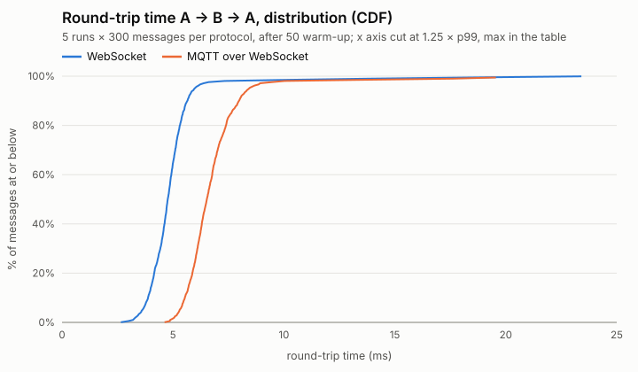
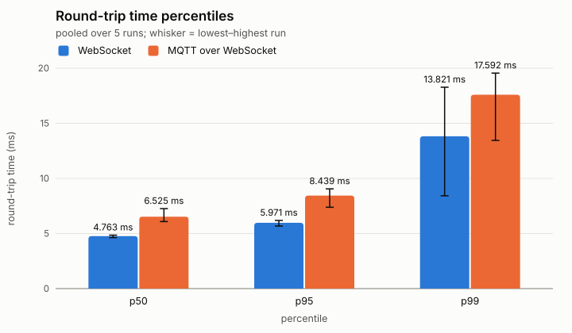
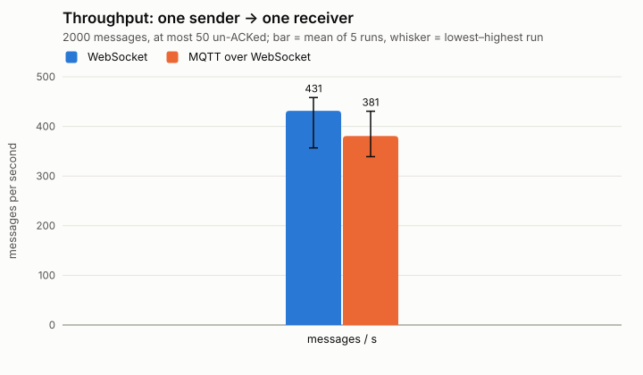
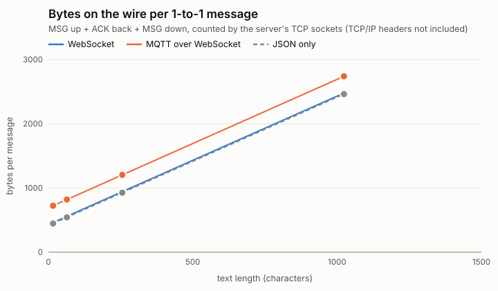
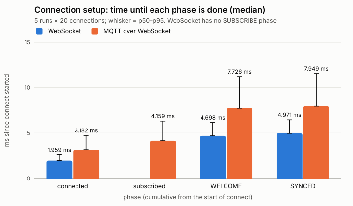
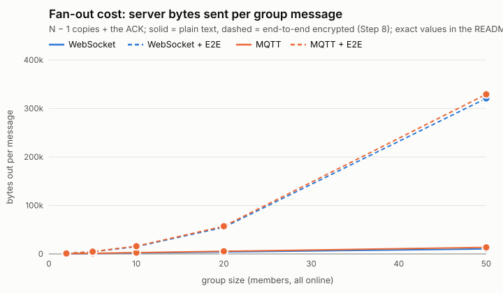
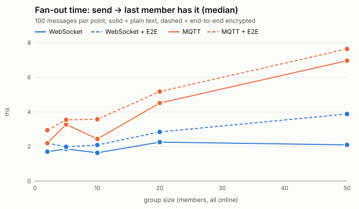
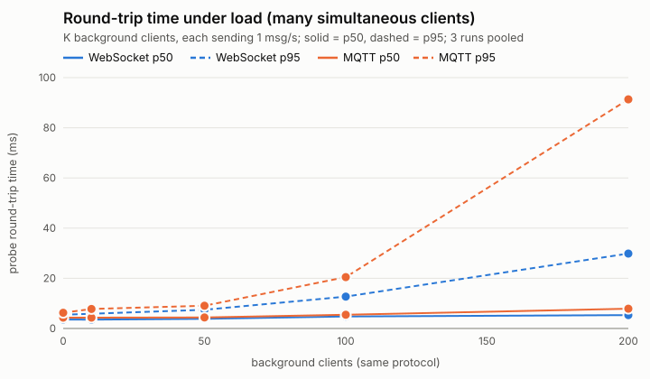

# Real-Time Client-Server Messaging System

CSEN 503 – Computer Networks, Winter 2026 (Instructor: Amr Saber)

> Status: **planning**. This README will grow into the 3-page design document.

## Team

| Member | Responsibility |
|---|---|
| _TBD_ | Server core + WebSocket protocol |
| _TBD_ | MQTT protocol + reliability (ACK, dedup, sync) |
| _TBD_ | Mobile web client UI |
| _TBD_ | Database, group chat, metrics + benchmarks |

## Overview

- One laptop runs the server; each member's phone is a client (mobile web page).
- All devices are on the same local Wi-Fi network.
- Messages are delivered in real time, with no loss, no duplication, and
  automatic synchronization of missed messages when a client reconnects.

## Planned Design

### Network / Link Layer
- Server binds to `0.0.0.0` so it is reachable on the laptop's Wi-Fi IP.
- Phones open `http://<laptop-ip>:<port>` in the browser.

### Transport Layer
- TCP (via WebSocket and HTTP) for reliable, ordered byte streams.
- Server handles many simultaneous connections; one client closing does not affect others.

### Application Layer – two protocols
1. **ChatProto v1 over WebSocket** (`/ws`): our own JSON protocol, request/response style.
2. **MQTT 3.1.1 over WebSocket** (`/mqtt`, Step 5): publish/subscribe through a broker
   (Aedes) embedded in the server. Same hub, same database: users of the two protocols chat
   with each other.

### ChatProto v1 (Step 2, extended for reliability in Step 3, groups in Step 7, E2E encryption in Step 8)
One JSON object per WebSocket text frame on `ws://<laptop-ip>:3000/ws`
(codec: `protocols/chatproto.js`, shared by server and browser).

```json
{ "v": 1, "type": "MSG", "id": "<uuid>", "ts": 1760000000000,
  "from": "alice", "to": "bob", "body": "hi", "seq": 42 }
```

`id` is chosen by the sender and identifies the message for deduplication; `seq` is
assigned by the server when it stores the message (ordering and offline sync).
**Addresses:** `to` is a username (`"bob"`, 1-to-1) or a group (`"#study"`: `#` + 1–20 of
`A-Z a-z 0-9 _`). A username can never contain `#`, so the address alone says which it is.

| Type | Direction | Fields |
|---|---|---|
| `HELLO` | client → server | `body.username` (1–20 of `A-Z a-z 0-9 _`), `body.token` (16–128 of `A-Z a-z 0-9 _ -`), `body.lastSeq` (optional integer ≥ 0, default 0), `body.key` (Step 8, optional: base64 Curve25519 public key, 32 bytes) |
| `MSG` | both | `to` (username or `#group`), `body`: text ≤ 2000 chars, **or (Step 8) a sealed object** `{nonce, box}` (1-to-1) / `{nonce, box, keys}` (group, `keys` = `{member: key box}` for every current member). Server sets `from` and adds `seq` |
| `GROUP` (Step 7) | both | client → server: `to` (`#group`), `body.op` (`create` / `add` / `leave`), `body.users` (usernames; for `create`/`add`, ≤ 50). Server → members: the same plus `from` (who did it), `seq`, `body.members` (the member list after the change) |
| `LIST` | client → server | – |
| `WELCOME` | server → client | `body.username`, `body.users` (online), `body.known` (all registered), `body.keys` (Step 8: `{username: public key}`) |
| `SYNCED` | server → client | `body.count` (messages replayed), `body.lastSeq` |
| `ACK` | server → client | `body.ref` (acked id), `body.seq`, `body.status` (`delivered` / `stored` / `duplicate`); for a group also `body.recipients` (other members) and `body.delivered` (how many got it live) |
| `PRESENCE` | server → client | `body.username`, `body.status` (`online`/`offline`), `body.key` (Step 8, with `online`) |
| `USERS` | server → client | `body.users` (online), `body.known` (all registered), `body.keys` (Step 8) |
| `ERROR` | server → client | `body.code`, `body.message`, `body.ref` |
| `BYE` | server → client (MQTT only) | `body.code` (e.g. `4001`), `body.reason`: "I am closing you, this is why" |

Error codes: `BAD_JSON`, `BAD_VERSION`, `BAD_TYPE`, `BAD_FIELD`, `TOO_LARGE`, `NOT_JOINED`,
`ALREADY_JOINED`, `NAME_TAKEN` (name registered to another token), `UNKNOWN_USER`
(recipient never joined), for groups `UNKNOWN_GROUP`, `NOT_MEMBER`, `GROUP_EXISTS`,
`GROUP_FULL` (> 50 members), and for encryption (Step 8) `KEY_MISMATCH` (`HELLO.key` differs from
the key registered for that name) and `STALE_MEMBERS` (a sealed group message's `keys` are not
exactly the current members; nothing was stored, re-seal and re-send with the same id). Malformed frames get an `ERROR` and the connection stays open;
frames over 16 KB close the socket with code 1009. The server pings every 30 s and drops
clients that do not answer. Close code `4001` = "replaced by a newer connection of the
same user"; the client must not auto-reconnect after it.

**Join and sync sequence:** `HELLO{lastSeq}` → `WELCOME` → every stored `MSG` to/from the
user, and every `MSG`/`GROUP` of the user's groups since they joined each one, with
`seq > lastSeq`, oldest first → `SYNCED`. Join and replay run in the same
event-loop turn, so no live message can arrive in the middle of the replay.

**Why still `v: 1`:** Step 3 adds types and fields and makes `HELLO.token` required. The
version field lets *independently deployed* peers detect incompatibility. Our server serves
the client page and codec from the same origin, so a client of another version cannot
exist, and v1 had not been frozen or released. Bumping to v2 would add a compatibility
branch with no client to use it. Step 7 is the same case and is also purely additive: one new
type (`GROUP`), a new address form (`#name`), two optional `ACK` fields and four error codes.
Every frame that existed before keeps its exact meaning. Step 8 is additive too:
- optional key fields in `HELLO` / `WELCOME` / `USERS` / `PRESENCE`;
- a second *form* of `MSG.body` (an object instead of a string);
- two error codes.

A string body still means plain text, exactly as before. Encryption is a property of the body,
not of the protocol version: the server routes both forms the same way.

Code layout: `protocols/chatproto.js` (format) and `protocols/mqtt-binding.js` (MQTT topics) →
`server/transports/websocket.js` / `server/transports/mqtt.js` (bytes ↔ ChatProto text) →
`server/core/dispatch.js` (the ChatProto state machine, shared by both transports) →
`server/core/hub.js` (protocol-agnostic routing, presence, sync) → `server/core/store.js`
(SQLite). `server/index.js` routes each WebSocket upgrade by path (`/ws` or `/mqtt`).
Monitoring (Step 6): `server/core/metrics.js` listens to the hub's events and counts TCP sockets;
`server/stats-routes.js` serves `/stats`, `/api/stats` and the SSE stream `/api/stats/stream`;
`client/stats.html` + `stats.js` + `stats.css` are the dashboard page.
Groups (Step 7) add no new files on the server: `hub.js` gains `sendGroup` / `changeGroup` /
`fanOut`, `store.js` the group tables and the schema migration, `dispatch.js` the `GROUP` route.
Tests: `tests/groups.test.js` (both protocols) plus group cases in the codec, store and
conversations unit tests.
Client side: `client/mqtt-socket.js` (an MQTT connection that looks like a WebSocket) →
`client/chat-client.js` (retry, dedup, reconnect; no UI) → `client/conversations.js`
(page state; no UI) → `client/app.js` + `index.html` + `style.css` (the phone UI).
End-to-end encryption (Step 8) is one new client file, `client/e2e.js` (TweetNaCl seal/open, key
ring, safety numbers), used by `chat-client.js` and served with TweetNaCl at `/vendor/nacl.min.js`.
On the server, the changes are:
- `store.js`: the key column, the `e2e` flag and migration 1 → 2;
- `hub.js`: pins and hands out keys, and the `STALE_MEMBERS` check;
- `chatproto.js`: the sealed-body format.

The server has no crypto code. Tests: `tests/e2e.test.js`.

### Reliability (implemented in Step 3)
TCP only guarantees delivery between two kernels while one connection lives; it cannot
know whether our server saved a message or whether a phone that lost Wi-Fi got it. So the
application adds its own end-to-end checks:

- **Store before ACK (no loss at the server).** The hub writes the message to SQLite
  (`node:sqlite`, WAL journal, `synchronous=FULL`) and only then is the `ACK` sent. ACK =
  "on disk", even if the server crashes right after.
- **Client retries until ACKed (at-least-once).** Unacknowledged messages stay in an outbox
  and are re-sent every 3 s with the *same id*. After 3 unanswered sends the client assumes
  a half-open connection and reconnects. The browser saves the outbox in `localStorage`, so
  a page reload cannot lose unsent messages.
- **Deduplication by id (exactly-once effect).** `messages.id` is `UNIQUE`; a retried id is
  not stored or delivered again, it is re-ACKed with its original `seq` and status
  `duplicate`. Receivers also ignore ids they have already seen.
- **Sequence numbers.** `seq INTEGER PRIMARY KEY AUTOINCREMENT`: strictly increasing, never
  reused, survives restarts. One server, one thread, so one global order.
- **Offline delivery (store-and-forward).** A message to an offline (but registered) user is
  stored and ACKed with `stored`; it is delivered by the next sync.
- **Offline sync.** The client remembers `lastSeq`, the highest `seq` it has received, and sends it
  in `HELLO`. The server replays everything after it. That makes `lastSeq` a *cumulative
  acknowledgement*, so receivers need no per-message receipts. A fresh page sends 0 and gets
  its full history.
- **Auto-reconnect with exponential backoff + jitter:** 0.5 s, 1 s, 2 s … max 10 s, ±25 %.
- **Identity on reconnect.** Each browser keeps a random token in `localStorage`. The first
  `HELLO` registers the username to that token (the server stores only its SHA-256 hash).
  Later, the same token is required. The same token while an old "zombie" session still exists
  takes it over (`4001`), so a phone that changed networks can reconnect immediately.

Database (`chat.db`, git-ignored; `DB_PATH` overrides), schema version 2 (`PRAGMA user_version`):

| Table | Columns | Notes |
|---|---|---|
| `users` | `username` PK, `token_hash`, `created_at`, `last_seen`, `public_key` (Step 8) | `public_key`: base64 Curve25519 key, set once by the first `HELLO` that has one, never replaced |
| `messages` | `seq` PK AUTOINCREMENT, `id` UNIQUE, `kind` (`text` / `create` / `add` / `leave`), `sender` → users, `recipient` → users, `group_name` → groups, `body`, `ts`, `stored_at`, `e2e` (Step 8, 0/1) | CHECK: exactly one of `recipient` / `group_name`; a membership change (`kind` ≠ `text`) belongs to a group and its `body` is JSON `{users, members}`. `e2e = 1`: `body` is the JSON of the sealed object (ciphertext) |
| `groups` (Step 7) | `name` PK (`#study`), `created_by` → users, `created_at` | the name is unique |
| `group_members` (Step 7) | `group_name` → groups, `username` → users, `joined_seq`; PK (`group_name`, `username`) | current members only; `joined_seq` = seq of the change that added them |

Indexes: `messages(recipient, seq)`, `messages(sender, seq)`, `messages(group_name, seq)`,
`group_members(username)`. Each sync query is a range scan on one of them.

**Migration.** A `chat.db` from Steps 3–6 (version 0) is upgraded once, at startup. SQLite's
`ALTER TABLE` cannot drop the old `recipient NOT NULL REFERENCES users` constraint, so
`messages` is rebuilt as the SQLite manual describes, in one transaction:
1. create the new tables;
2. create `messages_new`;
3. copy every row with its `seq`;
4. drop `messages`;
5. rename `messages_new` to `messages`;
6. keep the AUTOINCREMENT counter, so a seq is never handed out twice;
7. set `user_version = 1`.

If any step fails, the transaction rolls back and the old file is unchanged.

**Migration 1 → 2 (Step 8)** only *adds* columns, which `ALTER TABLE … ADD COLUMN` does in place
with no rebuild:
- `users.public_key`, NULL until that user's next `HELLO` with a key;
- `messages.e2e` with `DEFAULT 0`, so every older message counts as plain text.

It runs in the same transaction, and a Step 3–6 file goes 0 → 1 → 2 in one go.

### Mobile chat UI (Step 4)
Plain HTML/CSS/JS served from `client/` (no framework, no build step), designed for
360–430px phone screens first:

- **Screens:** join → chat list (online dot, last message, unread badge) → one chat
  (bubbles, time, delivery ticks). Opening a chat pushes a browser-history entry, so the
  phone's back gesture returns to the list.
- **Delivery ticks come from ChatProto:** 🕓 waiting (in the outbox, no `ACK` yet) ·
  ✓ stored (`ACK stored`/`duplicate`, or replayed from history) · ✓✓ delivered
  (`ACK delivered`) · ! refused (`ERROR` with `ref`).
- **Unread counts:** a "read up to seq N" cursor per chat, saved in `localStorage`, so a
  reload (which replays the full history) does not mark everything unread again.
- **Connection banner:** connecting / offline + reconnect countdown + messages waiting /
  "opened in another tab" (close `4001`, with a *Use here* button) / "N messages synced".
- **State → view:** ChatClient events only update the state (`client/conversations.js`,
  unit-tested in Node); `render()` redraws the screen from it.
- **XSS safety:** user text reaches the page only through `textContent`; a test fails if
  client code ever uses `innerHTML`, `outerHTML`, `insertAdjacentHTML` or `document.write`.
- **Phone details:** viewport meta, `100dvh`, safe-area insets, 16px gutter, 48px tap
  targets, 16px input font (no iOS zoom), light/dark colours, `aria-live` banner.
- **Debug panel** (`{ }` button, for the demo): raw frame log, `lastSeq`, outbox size,
  *Drop connection*, *Re-send last (same id)*, raw-frame input.

### MQTT – the second protocol (Step 5)
MQTT is a publish/subscribe protocol: clients never address each other, they **publish** to a
named **topic**, and a **broker** forwards the message to every client that **subscribed** to it.
It is binary (2–5 byte fixed header) with these packets: `CONNECT`/`CONNACK`,
`SUBSCRIBE`/`SUBACK`, `PUBLISH`/`PUBACK`, `PINGREQ`/`PINGRESP`, `DISCONNECT`.

**Stack.** Browser: [mqtt.js](https://github.com/mqttjs/MQTT.js), served by our own server at
`/vendor/mqtt.min.js` (phones need no internet). Server: the [Aedes](https://github.com/moscajs/aedes)
broker, embedded in the same Node process. Browsers cannot open raw TCP sockets, so MQTT runs
**over WebSocket** (binary frames, subprotocol `mqtt`): TCP → HTTP Upgrade → WebSocket → MQTT →
ChatProto JSON payload.

**Topics** (`protocols/mqtt-binding.js`). Each connection uses a fresh random client id
`c-<32 hex>` and exactly two topics:

| Topic | Direction | Payload |
|---|---|---|
| `chat/<clientId>/up` | client → server | ChatProto `HELLO` / `MSG` / `LIST` |
| `chat/<clientId>/down` | server → client | ChatProto `WELCOME` / `SYNCED` / `MSG` / `ACK` / `PRESENCE` / `USERS` / `ERROR` / `BYE` |

The payload of each PUBLISH is exactly one ChatProto JSON object, the same text a WebSocket
frame carries. Clients never publish to each other's topics: the hub must store the message,
give it a `seq` and check the sender before anyone receives it, and a WebSocket user could not
receive it otherwise. So the server is the only reader of `up` topics and the only writer of
`down` topics. Topics are per **connection**, not per user, so two tabs of one user never see
each other's traffic.

**Access rules** (Aedes hooks in `server/transports/mqtt.js`):
- `authenticate` (CONNECT): the client id must match `c-<32 hex>` and must not already be
  connected, otherwise CONNACK return code 2. (MQTT would let a newer connection with the same
  id take over the old one; with per-connection topics that would be a hijack.)
- `authorizeSubscribe`: only your own `down` topic. Another connection's topic or a
  wildcard (`chat/+/down`, `chat/#`, `#`) gets SUBACK `128` (refused).
- `authorizePublish`: only your own `up` topic, not retained; it is handed to the ChatProto
  state machine. Anything else closes the connection (MQTT 3.1.1 cannot refuse a single
  PUBLISH). Aedes calls this hook **before** it sends the PUBACK, so the message is in SQLite first.

**Login** stays the ChatProto `HELLO` (sent as the first PUBLISH after SUBACK). Both protocols
share one join path and get the same errors (`NAME_TAKEN` …). MQTT's username/password fields
are not used.

**MQTT reliability features – what we use and why**

| Feature | Used? | Why |
|---|---|---|
| QoS 0 (at most once) | no | can lose messages |
| **QoS 1** (at least once, PUBACK) | **yes, both directions** | duplicates are removed by our ChatProto `id` dedup, end to end |
| QoS 2 (exactly once, 4 packets) | no | only per hop and per connection: after a reconnect our client re-sends in a *new* MQTT session, which QoS 2 cannot recognise. Twice the packets for nothing |
| PUBACK as delivery receipt | no | it only means "broker received". Our `ACK` says "stored in SQLite, seq 42, delivered/stored" |
| Retained messages | no | a topic keeps only its **last** message (history would be lost) and it is re-sent on every subscribe. Presence comes from the hub |
| **Clean session** (`clean=true`) | **yes** | a persistent session would be a second offline queue (in Aedes memory, lost on restart, MQTT only). SQLite + `lastSeq` sync already does this for both protocols |
| Last Will (LWT) | no | the broker *is* our server: Aedes' `clientDisconnect` event tells the hub about every disconnect (DISCONNECT, socket closed, keepalive timeout) |
| **Keepalive** 30 s | **yes** | the client sends `PINGREQ` when idle; the broker drops a client silent for 1.5 × 30 s. It replaces our own WebSocket ping heartbeat |

**Closing with a reason (`BYE`).** A WebSocket close frame carries a code (`4001` = replaced),
but an MQTT 3.1.1 broker cannot tell a client why it disconnects it. So before closing a replaced
MQTT session the server publishes `BYE {code: 4001}`. The client then closes with that code
itself (the server cuts the connection after 2 s if it does not). ChatClient sees an ordinary
close with code 4001 and does not reconnect.

**Client side.** `client/mqtt-socket.js` makes an mqtt.js connection look like a WebSocket:
open = CONNACK + SUBACK, `send(text)` = PUBLISH QoS 1 to `up`, message = PUBLISH on `down`,
close = DISCONNECT. ChatClient takes an `openSocket` option and is otherwise unchanged, so the
outbox, retries, dedup, `lastSeq` sync and backoff reconnect are the same code for both
protocols. mqtt.js' own auto-reconnect is switched off (one reconnect policy only). On the join
screen the user picks **WebSocket** or **MQTT**, remembered per tab. The debug panel also lists
every MQTT packet (`CONNECT`, `SUBACK`, `PUBLISH … id=7`, `PUBACK id=7` …).

**Preparing the Step 9 comparison** (cost of one chat message, per direction):

| | ChatProto over WebSocket | ChatProto over MQTT over WebSocket |
|---|---|---|
| Connection setup | TCP + HTTP Upgrade, then `HELLO` → `WELCOME` | TCP + HTTP Upgrade + `CONNECT`/`CONNACK` + `SUBSCRIBE`/`SUBACK`, then `HELLO` → `WELCOME` (2 extra round trips) |
| Per message on the wire | WS header (2–8 B) + JSON | WS header + MQTT header (1 B + 2 B length) + topic (2 + 42–44 B) + packet id (2 B) + JSON: ≈ 50 B more |
| Per-hop receipts | none (TCP only) | `PUBACK` (4 B + WS header) for every PUBLISH, both directions |
| End-to-end receipt | ChatProto `ACK` | ChatProto `ACK` (the same) |
| Dead-peer detection | server ping every 30 s | client `PINGREQ` after 30 s idle, broker timeout 45 s |

### Group chat (Step 7)
Groups work the same over both protocols: one group can have WebSocket and MQTT members.

**Membership model: invite-only, members add.**

| Action | Who may do it | Refused with |
|---|---|---|
| `create #name` | any joined user; the creator + `body.users` become the members | `GROUP_EXISTS`, `UNKNOWN_USER` |
| `add` | any member, adding registered users | `NOT_MEMBER`, `UNKNOWN_GROUP`, `UNKNOWN_USER`, `GROUP_FULL`, `BAD_FIELD` (already members) |
| `leave` | any member | `NOT_MEMBER`, `UNKNOWN_GROUP` |
| send `MSG` to `#name` | members only | `NOT_MEMBER`, `UNKNOWN_GROUP` |

You cannot join a group on your own. There is no kick and no admin, so there is no
"what if the admin leaves" problem; admins and kicking would be an extension. A group has at
most 50 members, which caps the fan-out. Every check is done by the hub, inside the same SQLite
transaction as the write, so membership cannot change between the check and the insert.
The client is never trusted, and `from` is still set by the server.

**Membership changes are messages.** A `GROUP` request is stored in the `messages` table (`kind` =
the op) and gets a `seq`, exactly like a chat message. So it reuses every Step 3 guarantee:
- stored before the `ACK`;
- retried from the outbox (also across a reload);
- a retry is recognised by its id. The retry check runs **before** the authorization checks,
  so a retried `create` gets `duplicate`, not `GROUP_EXISTS`;
- offline members get it by sync;
- it has one place in the same order as the messages: carol added at seq 50 receives 51,
  never 49.

The server pushes the stored change as a `GROUP` event to everyone it concerns: the members
before **and** after the change, including the user who made it. Each event carries the full
member list after the change, so any single event tells a client who is in the group. The
creator's page learns the result the same way as everybody else, and its own request id comes
back as the event id.

**Fan-out.** A group message is stored **once** (one row, `group_name` set: fan-out on read).
The hub then pushes a copy to each **online** member except the sender (fan-out on write for
live delivery), in one synchronous loop. Offline members get it from the next sync.
- Cost per message: 1 SQLite write + fsync, *N − 1* `deliver()` calls (WebSocket frames or
  MQTT PUBLISH + PUBACK), 1 ACK. Storage is O(1) per message instead of O(N) for a per-user
  inbox.
- We do **not** let the MQTT broker fan out with a shared topic such as `chat/group/study`:
  - WebSocket members would never see it;
  - the message must be stored and get its `seq` before anyone receives it;
  - membership would have to be enforced a second time in `authorizeSubscribe`.

  Every copy goes down the member's own `down` topic or WebSocket, so the hub stays
  protocol-agnostic.

**Ordering: one global `seq`.** DMs and all groups share one counter.
- `lastSeq` stays a single cumulative acknowledgement. Per-group sequences would need a vector
  of cursors in `HELLO`.
- Every member sees a group's messages in the same order: the hub assigns the seq and then
  delivers in that order within one event-loop turn, each TCP connection is FIFO, and clients
  sort by seq.
- The cost is one serialisation point, which a single-threaded server has anyway. A cluster
  would need per-group sequences.

**Offline sync, extended.** The sync query returns three indexed range scans merged by `seq`:
1. DMs to me;
2. DMs from me;
3. every message and change of the groups I am in now, with `seq ≥ joined_seq` for that
   group.

So a new member sees the group from the moment they were added, not its older history (a
privacy rule). After leaving, the group is no longer replayed, and the page removes it from the
list.

**Delivery status.** The group `ACK` carries `recipients` (other members) and `delivered` (online
ones that got their copy).
- ✓✓ = **all** other members got it live.
- ✓ = at least one was offline and gets it from sync.
- The tooltip says "live to 2 of 3 members".

**Presence** stays global (`PRESENCE` frames go to everyone), so a group needs no presence of
its own. The header counts "4 members · 3 online".

**Phone UI.**
- The chat list shows groups (square `#` avatar, "N members").
- **+ Group** opens a form: name plus a checklist of registered users with their online state.
- A group chat has **+ Add** (same form) and **Leave**.
- Other people's bubbles show the sender's name.
- Membership changes appear as centred grey lines ("alice added carol", "bob left").
- Everything is still written with `textContent` only.

**Metrics.** One group message counts once in *Sent* and in msg/s (a logical message) and in
*…of them to groups*. *Copies delivered live* / *Copies stored for offline* count **per recipient
copy**: a group message to 3 others with 2 online adds 2 + 1. For 1-to-1 that is still exactly
1, so the Step 6 numbers keep their meaning.
- *Received live* and delivery latency are per copy, under the recipient's protocol.
- *Group changes* counts create/add/leave. The database card shows the number of groups.

### Monitoring – live metrics dashboard (Step 6)
Open `http://<laptop-ip>:3000/stats` (also linked from the join screen). It updates every second.

**What is measured** (`server/core/metrics.js`), each split into **WebSocket vs MQTT**:

| Metric | Kind | Source |
|---|---|---|
| Connections open / opened since start | gauge / counter | TCP sockets upgraded on `/ws` or `/mqtt` |
| Users online | gauge | the hub's online map, read at snapshot time |
| Messages per second (avg of the last 10 s) + chart of the last 60 s | rate | sliding window of 60 one-second buckets |
| Messages sent (new) · to groups · end-to-end encrypted (Step 8) · copies delivered live · copies stored for offline · duplicates · received live · replayed by sync · group changes | counters | hub events |
| Errors by code (`BAD_JSON`, `UNKNOWN_USER` …, `INTERNAL`) | counters | every ChatProto `ERROR` reply |
| Bytes in / out | counters | `socket.bytesRead` / `bytesWritten` of each TCP connection |
| Server latency: ACK and delivery, p50 / p95 / max (ms) | summary of the last 1000 samples | `performance.now()` |
| Messages, users and last `seq` in the database | totals that survive restarts | SQLite `COUNT(*)` / `MAX(seq)` |

- **Counter / gauge / rate.** A counter only goes up (resets on restart). A gauge is a current
  value that is never stored; it is read from the live state, so it cannot drift. A rate is
  a counter's growth per second.
- **Sliding window.** A ring buffer of 61 per-second buckets: 60 finished seconds plus the
  current one. A message adds 1 to the bucket of the current second. Buckets of seconds that
  have passed are reset and reused, so memory never grows. msg/s = sum of the last 10 *finished*
  seconds ÷ 10. A duplicate (retry) is not a new message and is not counted.
- **Latency (server-side part).** Both intervals start when the frame reaches the server.
  - **ACK latency** ends when the `ACK` is written to the sender's connection: parsing, the SQLite
    write with fsync, routing.
  - **Delivery latency** ends when the `MSG` is written to the recipient's connection. For
    WebSocket: the `ws.send` callback. For MQTT: the broker's publish callback.
  - It uses the **monotonic** clock `performance.now()`: sub-millisecond, and it never jumps when
    the OS corrects the wall clock. Phone clocks are not synchronised with the laptop, so
    phone-to-phone time is measured in Step 9 as a round trip on one clock.
  - p50 is the median; p95 shows the slow tail that an average hides.
- **Bytes on the wire.** Counted by Node's `net.Socket` on every upgraded TCP connection:
  the HTTP Upgrade, WebSocket and MQTT headers, topics, `PUBACK`s, pings and our JSON. That is the
  real overhead the Step 9 comparison needs.

**Design: metrics stay out of the protocol logic (observer pattern).** The hub is an
`EventEmitter`. The hub and `dispatch.js` only announce what happened: `message`, `delivered`,
`acked`, `synced`, `failure`. `metrics.js` is the only listener and decides what to count.
Transports only gained an optional "written" callback, `session.deliver(msg, onSent)`.
`server/index.js` hands each upgraded TCP socket to `metrics.trackSocket()`.

**Live updates: Server-Sent Events.** `GET /api/stats/stream` is one HTTP response that never
ends (`Content-Type: text/event-stream`). Every second the server writes `data: <snapshot JSON>`
followed by an empty line. The page reads it with the browser's built-in `EventSource`, which
reconnects by itself (the server sends `retry: 2000`).
- *Why not polling:* polling costs a full HTTP request per update.
- *Why not a WebSocket:* a dashboard on `/ws` would count itself as a chat connection.
- SSE is one-way (server → page), which is all a dashboard needs.
- The server pushes on a fixed 1 s tick, not per message, and computes one snapshot for all viewers.

`GET /api/stats` returns the same snapshot once, for curl and the Step 9 benchmark script.
The chart uses Chart.js, served by our server at `/vendor/chart.umd.min.js` so phones need no
internet. Like the chat, the page writes text only through `textContent` (checked by the XSS test).

### End-to-end encryption (Step 8)
The server stores and forwards **ciphertext only**, for 1-to-1 and group messages, over both
protocols. Messages are encrypted on the sender's phone and decrypted on the recipients' phones.
The server keeps doing everything it did before (store, `seq`, ACK, fan-out, sync) without being
able to read a message, and it contains no crypto code at all.

**Library: [TweetNaCl](https://tweetnacl.js.org)** (`tweetnacl`, a JavaScript port of NaCl). It is
small, audited, has no dependencies, and is the same API in Node (tests) and in the browser. Our
server serves it at `/vendor/nacl.min.js` (phones have no internet).

| Primitive | What it is | Used for |
|---|---|---|
| Curve25519 (X25519) | public-key Diffie–Hellman: my secret key + your public key = the same 32-byte shared secret as your secret key + my public key | key agreement; the server only ever sees the public halves |
| XSalsa20 | stream cipher: key + 24-byte nonce → keystream, XOR the text | confidentiality |
| Poly1305 | one-time MAC, a 16-byte tag | integrity + authenticity: a changed bit or a wrong key → `open` returns null |
| `nacl.box` | X25519 + XSalsa20-Poly1305 | 1-to-1 messages; group key boxes |
| `nacl.secretbox` | XSalsa20-Poly1305 with a key you already have | the body of a group message |
| `nacl.hash` (SHA-512), `randomBytes` | hash, secure random | safety numbers, ciphertext binding; keys and nonces |

**Keys on the device.**
- On a device's first join as a name, the page creates a key pair and stores it in `localStorage`
  (`chat.keys.<name>`), next to the Step 3 device token.
- The secret key never leaves the browser.
- `HELLO.key` uploads the public key. The server **pins** it in `users.public_key`, like the
  token: a later `HELLO` with a different key gets `KEY_MISMATCH`.
- `WELCOME` / `USERS` (`keys`) and `PRESENCE online` (`key`) hand the keys out, so the server is
  the key directory.

**1-to-1:** `body = {nonce, box}`, where `box = nacl.box(inner, nonce, bobPublic, aliceSecret)`.
- Bob opens it with `(alicePublic, bobSecret)`.
- Alice can open it too with `(bobPublic, aliceSecret)`: it is the same shared key. So her own
  history, replayed by sync after a reload, still decrypts.

**Groups: a fresh key per message, boxed to each member.** For each group message the sender:
1. picks a random 32-byte key K;
2. encrypts the text **once**: `box = secretbox(inner, nonce, K)`;
3. for **every current member, herself included**, adds
   `keys[member] = nacl.box(K ‖ SHA-512(box)[0..32], nonce, memberPublic, senderSecret)`, 80 bytes each.

Why this scheme:

| Option | Frame size | Membership change | Verdict |
|---|---|---|---|
| (A) the whole message boxed per member | N × text | nothing to do | wastes bandwidth with long texts |
| **(B) per-message key K, boxed per member** | text + N × 108 chars | **nothing to do** | **used** |
| (C) long-lived group key / Signal "sender keys" | text | every leave forces all members to rotate keys | complex state, not needed for ≤ 50 members |

- Every message is encrypted to the members *at that moment*. Someone who left has no key box in
  the next message. Someone just added has none in older ones, and the Step 7 sync does not send
  those anyway. So no re-keying protocol is needed.
- **Cost relative to Step 7:**
  - the fan-out is unchanged: 1 stored row, N − 1 `deliver()` calls of the *same* frame; the
    server does not re-encrypt per member;
  - the frame grows by about N × 120 bytes;
  - the sender does N `box` operations, each a fraction of a millisecond.
- The worst case (2000 three-byte characters, 50 members with 20-character names) is tested to
  fit in the 16 KB frame limit.
- **`STALE_MEMBERS`.** The hub checks, in the same transaction as the membership check, that
  `keys` names exactly the current members. If someone joined or left while the message was on
  its way, it is refused **before it is stored**.
  - The `GROUP` event with the new list has already reached the sender: one connection is FIFO,
    and the server sent the event before handling the message.
  - So ChatClient opens its own message (it has a key box for itself), re-seals it for the new
    list, and re-sends it with the **same id**. The id is still unused.
  - The page never sees the error.

**Nonces.**
- 24 random bytes per message. With XSalsa20's 192-bit nonce, random nonces are safe, and no
  counter has to be kept across devices.
- The rule is "never the same nonce twice *with the same key*". In a group message the one nonce
  is used with K and with each member's shared key, and those are all different keys.
- A retry re-sends the identical frame (same id, same nonce, same ciphertext). That is the same
  message, not a reuse.

**Authentication and context binding.**
- The plaintext is JSON `{from, to, id, ts, text}`. The receiver checks it against the envelope.
  So the server cannot:
  - move a message to another chat;
  - swap `from` / `to` (in 1-to-1 both directions use the same shared key);
  - replay it under a new id or a new time.
- A successful `box.open` with alice's public key proves alice (or the recipient) made it.
- In a group every member knows K. The hash of the ciphertext inside each key box stops a member
  from putting a different text under the sender's name: carol's key box was made by alice and
  names alice's exact ciphertext.
- `box` is **deniable**, not signed. Bob is convinced, but cannot prove it to a third party
  (that would need `nacl.sign`).

**Trust: what a malicious server could do, and the defences.**
- The server hands out the public keys. A malicious server could give alice *its own* key as
  "bob's" (man in the middle) and read everything.
- **TOFU pinning.** Each page pins the first key it sees for each contact (`chat.pins.<name>`).
  If the server later presents a different key:
  - ChatClient emits `keychange`;
  - the chat shows a red bar;
  - sending to that contact is blocked;
  - incoming messages are still opened with the pinned key.

  The user can accept the new key only after comparing the new safety number.
- **Safety numbers.** 30 digits from SHA-512 over both names and public keys (sorted, so both
  phones compute the same number). Users compare them in person. Equal numbers mean nobody,
  including the server, swapped a key. This defeats a man in the middle even at first contact.
- Tested: a key replaced directly in the database is detected, and the safety number differs.

**What the server still sees (metadata).**
- who talks to whom (`from`, `to`);
- when (`ts`, `stored_at`), and the order (`seq`);
- online times;
- message **sizes** (ciphertext = text + 16 bytes + base64 overhead);
- group names and memberships, which it must enforce;
- the number of members of each group message (the `keys`).

E2E hides **content** only.

**What we do NOT provide.**
- **Forward secrecy.** One long-term key pair per user. A secret key stolen later decrypts every
  old ciphertext still stored on the server. Signal's Double Ratchet derives a new key per
  message and deletes old ones.
- **Post-compromise security** and **key rotation / multi-device.** One key per username,
  forever. A new phone means a new username.
- **Protection against a malicious server sending a malicious page.** The web app's JavaScript
  comes from the server it is meant to protect against. Native apps from an app store do not have
  this problem.
- **Enforcement on the server.** The server cannot check that a body really is ciphertext (random
  bytes look like ciphertext). Plain-text `MSG`s are still accepted: the Step 2–7 tests use them
  to test routing. Our client always encrypts and marks any plain message it receives
  "⚠ not encrypted", since it has no proof of who wrote it.

**Reliability on ciphertext.** Nothing in Steps 3–7 reads the text:
- id dedup, store-before-ACK, `seq`, `lastSeq` sync and fan-out all use the envelope;
- `send()` seals *before* the message enters the outbox, so retries are byte-identical;
- the outbox saved in `localStorage` holds only ciphertext;
- after a reload, the page opens its own pending messages to show them.

**UI.**
- A lock bar under each chat header: "🔒 End-to-end encrypted · tap for safety number". In a group
  it says "for N members".
- Tapping it shows the 30-digit safety number.
- A changed key turns the bar red, with an *accept* button.
- Bubbles that do not decrypt say "🔒 Could not decrypt this message".
- Unencrypted ones are marked "⚠ not encrypted".
- The debug panel's frame log shows the real frames: `nonce`, `box`, `keys`.
- Decrypted text still reaches the page only through `textContent`.

**Metrics.** *…of them end-to-end encrypted* counts sealed messages per protocol: the server can
tell a sealed body from text, but not read it. The database card shows "Messages stored: N
(M encrypted)". Bytes on the wire now include the ciphertext overhead, for Step 9.

## Performance Evaluation (Step 9)
We compare our two application-layer stacks, which carry the *same* ChatProto JSON:
**ChatProto over WebSocket** (`/ws`) and **ChatProto over MQTT over WebSocket** (`/mqtt`).
Both use the same hub, SQLite store, ACKs and sync, so any difference comes from the transport.

### Method
**Setup.** Everything runs on one laptop: Intel i5-12500H (16 threads), 16 GB, Windows 11,
Node 24.19.0. There are three processes:
- **Server.** `benchmarks/run.js` starts `node server/index.js` as a **child process** on port 3109,
  with a **fresh temporary database** (`PORT` / `DB_PATH`). The real `chat.db` is never touched.
- **Probe.** The runner process holds two clients, A and B, which do the timing.
- **Load generator.** For the scalability test, a third process (`benchmarks/load.js`) runs the
  background clients.

Client and server talk over **loopback** (`127.0.0.1`). The numbers are therefore the cost of our
software stack *without* Wi-Fi radio time.

**What one sample is.**
- **Latency = round trip on one clock.**
  - A sends a `MSG` to B, and B immediately sends the same text back. A times the whole trip
    A → server → B → server → A with `performance.now()`.
  - That is a monotonic, sub-millisecond clock, and the same one is read at both ends, so no clock
    synchronisation is needed. Phones cannot measure one-way time: their clocks are off by more than
    the latency.
  - A round trip contains **two** messages, each stored in SQLite before it is forwarded.
  - A also records its **ACK time**: A → server (stored) → ACK back to A.
- **One message at a time** (closed loop). The next ping is sent only after the previous echo
  arrived, so no queue can build up inside our measurement.
- **Warm-up.** The first messages of every run are sent but not recorded: 50 for latency, 200 for
  throughput, 10 for groups, 3 connections for setup. Before they run, V8 has not compiled the hot
  code yet (JIT) and SQLite's page cache is cold.
- **Independent runs.** Every run opens new connections. The protocol order alternates (WS first,
  then MQTT first …), so a slow drift of the laptop cannot favour one protocol.
- **Statistics.** We report:
  - the mean and the sample standard deviation (sd);
  - the **nearest-rank percentiles** p50 (median), p95 and p99;
  - min and max;
  - for latency, also the **run-to-run spread** (the same percentile computed per run). A difference
    smaller than that spread is not a difference.

  Latency is right-skewed (a garbage-collection pause or a slow disk write adds a long tail), so the
  median and the tail say more than the mean.
- **Bytes on the wire** come from the Step 6 counters (`/api/stats`): `socket.bytesRead` /
  `bytesWritten` of every upgraded TCP connection. That includes the HTTP Upgrade, WebSocket frame
  headers, MQTT headers and topics, PUBACKs, pings and JSON, but **not** the TCP/IP headers that the OS
  adds (~40–52 B per segment).
- **Nagle is off.** Node's HTTP server and the `ws` library call `socket.setNoDelay()`
  (TCP_NODELAY) on every socket (`ws/lib/websocket.js`). A small frame is sent at once instead of
  waiting up to ~40–200 ms to be merged with the next one. That is why round trips are ~5 ms, not
  ~40 ms.

**Not measured.**
- Wi-Fi radio time and distance. `--url` makes the same scripts run against a remote server, but we
  had no second computer to run them from, so we report **scalability** instead (the brief allows
  either).
- The phone's CPU, browser and page rendering.
- Decryption time on the receivers.
- The latency of a message to an offline user (it waits for their next sync).

Raw samples: `benchmarks/results/local/*.csv`. Summaries with the exact configuration and
environment: `*.json`. Reproduce:
- `node benchmarks/run.js` (≈ 5 minutes);
- `--only=latency,bytes` for some experiments only;
- `--quick` for a smoke test;
- `node benchmarks/charts.js` redraws the charts from the saved JSON.

Code (no new dependencies):
- `benchmarks/run.js`: the runner and the experiment sizes;
- `benchmarks/experiments.js`: the seven experiments;
- `benchmarks/load.js`: the background-load process;
- `benchmarks/lib/client.js`: a minimal ChatProto client over either protocol, which records the
  setup phases;
- `benchmarks/lib/server.js`: starts or attaches to the server and reads `/api/stats`;
- `benchmarks/lib/stats.js`: mean, sd, percentiles, CDF;
- `benchmarks/lib/svg.js` + `benchmarks/charts.js`: the SVG charts.

Tests: `tests/benchmarks.test.js` (the statistics, plus every experiment end to end with tiny counts).

### 1. Latency




5 runs × 300 round trips per protocol after 50 warm-up, 64-character text. Times in ms.

| | mean ± sd | p50 | p95 | p99 | max | p50 run-to-run (sd, range) | ACK p50 / p95 | server ACK p50 (Step 6) |
|---|---|---|---|---|---|---|---|---|
| WebSocket | 4.93 ± 1.70 | **4.76** | 5.97 | 13.8 | 28.3 | 0.09 (4.63–4.85) | 2.57 / 3.43 | 2.09 |
| MQTT over WS | 6.83 ± 2.03 | **6.53** | 8.44 | 17.6 | 39.7 | 0.54 (6.08–7.26) | 3.79 / 5.08 | 2.97 |

- **MQTT adds ≈ 1.8 ms per round trip (+37 % at p50), ≈ 0.9 ms per message.** The gap is 3–20 times
  larger than the run-to-run spread of the medians, and the two CDFs do not overlap until the top
  ~2 %. It is a real difference.
- At **p99** the two overlap: the runs range from 8.4 to 18.3 ms (WS) and from 13.4 to 19.6 ms
  (MQTT). Those 1-in-100 messages are dominated by events that hit both protocols, such as a slow disk
  flush, not by the protocol.
- **Where the time goes** (the WebSocket ACK, 2.57 ms):
  - 2.09 ms inside the server (the Step 6 metric);
  - of that, **1.65 ms is the SQLite write with fsync** (experiment 7 below);
  - the remaining ≈ 0.5 ms is the client libraries plus loopback.

  The cost of "ACK = on disk" is thus most of the latency, and it is the same for both protocols.
- **Why MQTT is slower:**
  - more work per message: an extra PUBACK packet per hop;
  - topic matching and the broker's packet queue in Aedes;
  - its packets are written as many small WebSocket frames (see 3).

  Its server-side ACK time is 0.9 ms higher (2.97 vs 2.09).

### 2. Throughput



One sender, one receiver, 2000 messages per run, at most 50 un-ACKed; 5 runs.

| | mean ± sd (msg/s) | lowest–highest run |
|---|---|---|
| WebSocket | **431 ± 42** | 357–458 |
| MQTT over WS | **381 ± 38** | 339–431 |

- The ceiling is the **disk**, not the network. Each message is one SQLite commit with fsync, about
  1.9 ms on average, so one server thread cannot exceed about 1000 / 1.9 ≈ **525 msg/s** whatever
  the protocol.
- WebSocket reaches 82 % of that bound and MQTT 73 %, because of its extra per-message work.
- The run-to-run spread is large (± 10 %): fsync time depends on what Windows and the SSD are doing.
  So "WS is faster" holds on average, but the worst WS run was slower than the best MQTT run.
- Batching several messages into one commit (group commit) would raise the ceiling, at the cost of
  a slightly later ACK.

### 3. Bytes on the wire per message



A 1-to-1 message is three frames: `MSG` up, `ACK` back to the sender, `MSG` down to the recipient.
Measured over 100 messages per row:

| text | JSON of the 3 frames | WebSocket total | WS overhead | MQTT total | MQTT overhead | MQTT / WS |
|---|---|---|---|---|---|---|
| 16 chars | 447 B | 461 B | 14 B | 724 B | 271 B | 1.57 × |
| 64 | 543 | 559 | 16 | 820 | 271 | 1.47 × |
| 256 | 927 | 943 | 16 | 1204 | 271 | 1.28 × |
| 1024 | 2463 | 2479 | 16 | 2740 | 271 | 1.11 × |

- The overhead does **not** grow with the text. It is a fixed cost per message, so it matters most
  for short chat messages, which is what a chat mostly sends.
- **WebSocket overhead:** 2–8 B of frame header per frame. Client frames are masked: +4 B.
  Frames over 125 B: +2 B of length.
- **MQTT overhead, accounted byte by byte.** For the 16-character row this predicts 255 B in and 463 B
  out; we measured 257 and 467 (2–4 B apart). The parts are:
  - topic names of 42 / 44 / 44 B (`chat/<clientId>/up|down`), the biggest part;
  - 2 B of topic length, 2 B of packet id, and 1 + 2 B of fixed header per PUBLISH;
  - **three PUBACKs** of 4 B (one per hop);
  - and a finding we did not predict in Step 5: **mqtt.js and Aedes write each PUBLISH as 6
    separate WebSocket frames** (fixed header, length, topic length, topic, packet id, payload) and
    each PUBACK as 3. Every frame pays its own 2–6 B WebSocket header, which adds ≈ 80 B per message.

  Step 5 predicted ≈ 50 B more per PUBLISH plus small PUBACKs, ≈ 180 B per message. The measured
  extra is 257 B, and the frame splitting is the difference.
- On a real network each of those small frames may also become its own TCP segment, with
  ~40–52 B of TCP/IP headers. Loopback does not show this; it would need a packet capture.

### 4. Connection setup



Time from the start of `connect()` until each phase completes, 5 runs × 20 reconnections of an
already registered user, no history to replay. Times in ms.

| | connected | subscribed | `WELCOME` | `SYNCED` p50 / p95 / mean ± sd | bytes up / down |
|---|---|---|---|---|---|
| WebSocket | 1.96 (TCP + HTTP Upgrade) | – | 4.70 | **4.97** / 6.46 / 5.17 ± 2.25 | 388 / 571 |
| MQTT over WS | 3.18 (+ CONNECT/CONNACK) | 4.16 (SUBSCRIBE/SUBACK) | 7.73 | **7.95** / 11.55 / 8.83 ± 6.30 | 734 / 762 |

- MQTT needs the 2 extra round trips predicted in Step 5 (`CONNECT`/`CONNACK`, `SUBSCRIBE`/`SUBACK`)
  before our `HELLO` can be sent.
- It ends **3 ms later (+60 %)** and costs **1496 vs 959 bytes (+56 %)**.
- About half of the setup time is the `HELLO` itself: the token check and the join write in SQLite.
- On Wi-Fi every extra round trip costs a full radio RTT (typically 2–10 ms), so the gap would
  grow there. This matters for phones that reconnect often (screen off, network change).

### 5. Group size and end-to-end encryption




For each protocol and group size, all members are online. The sender sends 10 warm-up + 100
messages per mode:
- **plain:** the Step 7 text body;
- **E2E:** the Step 8 sealed body, `{nonce, box, keys}`.

*Frame* = the sender's `MSG` in bytes. *Out* = server bytes sent per message: N − 1 copies + the ACK
(+ PUBACKs). *Fan-out* = send → the last member has it (p50). *Seal* = the sender's `sealGroup()`
time (p50). The `keys` part grows by about N × 122 B.

| members | frame plain → E2E | out WS plain → E2E | out MQTT plain → E2E | fan-out WS plain / E2E (ms) | fan-out MQTT plain / E2E (ms) | seal (ms) |
|---|---|---|---|---|---|---|
| 2 | 172 → 655 B | 407 B → 890 B | 543 B → 1.0 KB | 1.70 / 2.21 | 2.20 / 2.95 | 1.8 |
| 5 | 172 → 1015 B | 1.0 KB → 4.4 KB | 1.4 KB → 4.8 KB | 1.86 / 1.98 | 3.28 / 3.55 | 3.3 |
| 10 | 173 → 1630 B | 2.1 KB → 15 KB | 2.7 KB → 16 KB | 1.64 / 2.09 | 2.44 / 3.58 | 6.5 |
| 20 | 173 → 2850 B | 4.1 KB → 55 KB | 5.4 KB → 57 KB | 2.26 / 2.85 | 4.52 / 5.18 | 17.9 |
| 50 | 173 → 6510 B | 10 KB → 321 KB | 14 KB → 329 KB | 2.10 / 3.88 | 6.96 / 7.64 | 36.6 |

- **Bytes.**
  - Plain fan-out bytes grow **linearly** with N: one copy per member.
  - With E2E, every copy also carries every member's key box. So the bytes grow with
    **N × (N − 1)**, roughly quadratically: ×31 at 50 members (321 KB per message).
  - This is the price of scheme (B) from Step 8: no group key and no re-keying, but a frame that
    grows with the group.
  - Up to the 50-member cap a sealed frame still fits the 16 KB limit (6.5 KB). But one message
    makes the server send 321 KB, which takes ≈ 2.6 s on a 1 Mbit/s share of Wi-Fi. Bigger groups would need a shared group key
    (scheme C).
- **Server time.**
  - WebSocket fan-out stays at ≈ 2 ms up to 50 members: writing 49 frames is cheap next to the
    fsync.
  - MQTT grows by ≈ 0.1 ms per member (2.2 → 7.0 ms): every copy is a broker PUBLISH, with a
    packet id and a PUBACK to process.
  - E2E adds little server time (the server never decrypts). At 50 members it adds about 1.8 ms,
    for copying 300 KB.
- **Sender time.**
  - Sealing costs ≈ 0.7 ms **per member** on the laptop (37 ms for 50), several times more on a
    phone.
  - `nacl.box` redoes the Curve25519 key agreement for each member on every message.
  - **Improvement found:** cache each member's shared key with `nacl.box.before()` once and use
    `nacl.box.after()`. That makes it a symmetric operation (microseconds). Not changed in this
    step.

### 6. Scalability: many simultaneous clients



The probe pair measures round trips (30 warm-up + 150 samples, 3 runs) while K **other** clients of
the same protocol each send 1 message per second to a partner. That is K msg/s of background chat,
each message stored with fsync. RTT in ms:

| K clients | offered load | WS p50 | WS p95 | WS p99 | MQTT p50 | MQTT p95 | MQTT p99 | achieved load WS / MQTT | errors |
|---|---|---|---|---|---|---|---|---|---|
| 0 | 0 msg/s | 3.58 | 5.46 | 15.6 | 4.30 | 6.26 | 16.5 | – | 0 |
| 10 | 10 | 3.51 | 5.86 | 20.0 | 4.33 | 7.78 | 17.3 | 9.5 / 10.3 | 0 |
| 50 | 50 | 3.85 | 7.45 | 16.1 | 4.41 | 9.07 | 14.1 | 51 / 48.7 | 0 |
| 100 | 100 | 4.80 | 12.7 | 24.3 | 5.48 | 20.5 | 30.8 | 98.4 / 99.1 | 0 |
| 200 | 200 | 5.31 | **29.9** | 56.6 | 7.88 | **91.3** | 148 | 196 / 199 | 0 |

- **No errors, no lost messages, and the median barely moves** (+48 % WS, +83 % MQTT at 200
  clients). The server handled 200 simultaneous clients plus the probe on each protocol.
- **The tail grows first, and it grows like a queue.**
  - The server is one thread, and each stored message blocks it for ≈ 2 ms (WS) / ≈ 3 ms (MQTT)
    of SQLite + fsync.
  - At 200 msg/s it is busy ≈ 40 % (WS) / ≈ 60 % (MQTT) of the time. A probe message that arrives
    behind a few others waits for them.
  - Queueing theory says the waiting time grows like ρ / (1 − ρ), where ρ is the utilisation. That
    is why MQTT's p95 jumps from 20 to 91 ms between 100 and 200 clients while WebSocket's goes from
    13 to 30 ms.
  - MQTT reaches the "knee" of the curve earlier because each of its messages costs more server time.
- **The load generator kept up.** It achieved its offered rate (196–199 of 200 msg/s), so the slow
  tail is the server, not our measuring tool.
  - Its event-loop delay p99 of ≈ 22–25 ms at every level is the Windows timer resolution
    (~15.6 ms), not overload.
- **Caveat.** The K = 0 baseline here (3.6 ms WS) is lower than in experiment 1 (4.8 ms). The code is
  the same; the two experiments ran minutes apart, and laptop CPU frequency and power state change
  absolute times. So compare WS vs MQTT and K vs K **within** one experiment, not across experiments.

### 7. Storage (where the server's time goes)

`Store.saveMessage()` (our server code) on a temp file, 1000 inserts after 50 warm-up:

| `PRAGMA synchronous` | p50 | p95 | p99 | mean ± sd |
|---|---|---|---|---|
| `FULL` (what the server uses: wait for the disk) | **1.65 ms** | 2.44 | 5.20 | 1.90 ± 2.84 |
| `OFF` (hand the write to the OS, no fsync) | 0.055 ms | 0.14 | 0.32 | 0.07 ± 0.06 |

- The fsync is **≈ 97 %** of the cost of storing a message, and **≈ 79 %** of the server's whole
  WebSocket ACK time (1.65 of 2.09 ms).
- It is our deliberate trade-off from Step 3: an ACK means the message survives a power cut.
  `synchronous=NORMAL` in WAL mode would skip this fsync on every commit (close to the `OFF`
  numbers; not measured separately), but could lose the last ACKed messages on power loss.

### Conclusions
- **Over loopback, ChatProto over WebSocket is consistently cheaper than ChatProto over MQTT:**
  - −27 % latency (p50 round trip 4.8 vs 6.5 ms);
  - +13 % throughput;
  - −36 % bytes for a short message (461 vs 724 B);
  - −37 % connection setup time (5.0 vs 7.9 ms);
  - a lower tail under load (p95 30 vs 91 ms at 200 clients).
- **This is expected.** Our app already does at the ChatProto level everything MQTT offers
  (end-to-end ACKs, dedup, sync), so for us MQTT's QoS 1, PUBACKs, topics and broker are pure
  overhead. MQTT's real strengths do not apply to our design:
  - many-to-many routing without a server application (we must store and sequence every message
    anyway);
  - persistent sessions;
  - small binary payloads for sensors;
  - a standard protocol for third-party clients.
- **Both protocols** deliver every message with no errors at 200 simultaneous clients, and the
  latency is dominated by the fsync that makes our ACK trustworthy.
- **End-to-end encryption** costs nothing measurable on the server, but frames grow by about
  122 B per member, so group traffic grows with N². The sender's per-member sealing time can be
  made ≈ 0 by caching shared keys.

## Repository Structure

```
server/      server code (connections, routing, storage, metrics)
client/      mobile web client (HTML/CSS/JS)
protocols/   message format definitions for each protocol
benchmarks/  performance test scripts and results
docs/        design document and diagrams
```

## Progress

- [x] Step 1 – Server skeleton: phones reach the laptop over Wi-Fi (HTTP, LAN IP, QR code)
- [x] Step 2 – ChatProto v1: custom protocol over WebSocket
- [x] Step 3 – Reliability: SQLite storage, ACKs, deduplication, offline sync
- [x] Step 4 – Mobile chat UI
- [x] Step 5 – MQTT: second application-layer protocol
- [x] Step 6 – Live metrics dashboard
- [x] Step 7 – Group chat
- [x] Step 8 – End-to-end encryption
- [x] Step 9 – Benchmarks and charts
- [ ] Step 10 – Documentation, demo rehearsal, oral defense prep

## Running

Requires Node.js 24+ (uses the built-in `node:sqlite`).

```bash
npm install
npm start
npm test        # unit + integration tests
```

`PORT` and `DB_PATH` run a second copy without touching the real database, e.g.
`PORT=3105 DB_PATH=/tmp/test.db npm start` (bash) or
`$env:PORT=3105; $env:DB_PATH="$env:TEMP\test.db"; npm start` (PowerShell).

Live metrics: `http://<laptop-ip>:3000/stats` (JSON: `/api/stats`).

The server prints its Wi-Fi address and a QR code. Open that address on a phone connected
to the same Wi-Fi. If the phone cannot connect, allow Node.js through Windows Firewall
(Private networks).
